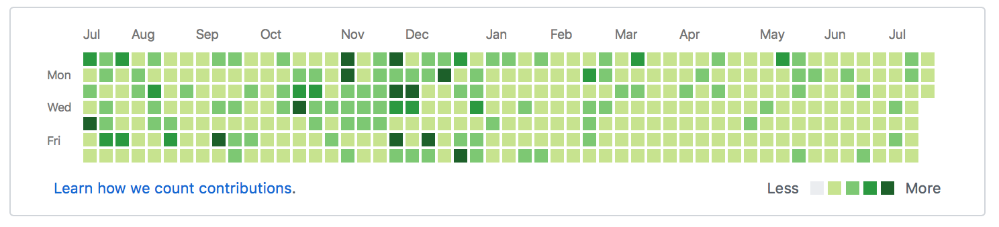

# git_painter

> 无聊的时候刷GitHub发现，好多大牛主页的贡献记录都是一片绿色，比如阮一峰老师的，如下图。
> 于是也想把自己的全部刷成绿色，在折腾的过程中觉得就一片绿好像没意思，于是就有了如下效果。

阮一峰的github


我的github


## 简介
* 原理
操作原理很简单，GitHub贡献记录显示是给予提交时间的，只需要修改系统时间之后再`commit`就OK啦

* 功能
1. 一个脚本自动搞定
2. 方便的自定义形状
3. 设置定时任务，每天自动`commit`&`push`

> **重要:** 由于有一些坑，为节约大家时间，请看完教程再进行操作

## 使用方法
将该项目下载到本地，本地需要使用`Linux`操作系统，直接放服务器上也可以。
下载完之后先删除`.git`文件夹
```bash
git clone git@github.com:YES-Lee/git_painter.git && cd git_painter && rm -rf .git // 可以直接下载zip在解压

```
重新初始化git
```bash
git init
git add .
git commit -m 'init'

```

然后执行loop脚本刷记录，等待结束
```bash
python loop.py

```

GitHub，将该项目推上去，然后就可以到GitHub上看效果啦
```bash
git remote add origin {仓库地址}
git push -u origin master

```

在服务器部署自动commit
```bash
crontab -e
#  输入以下代码，前两个参数分别是分钟和小时，该任务为每天12:00定时执行
# 00 12 * * * cd /home/git_heart && git pull && /usr/bin/python main.py

```

## 参数说明
`main.py`用于在服务端执行定时任务的脚本，`loop.py`用来刷之前的记录
```python
#  loop.py
#  自定义图形
PATTEN = [  # 图形矩阵，可以通过修改该变量来设置不同的图形，行建议最多不超过7行
    [0, 1, 1, 0, 0, 0, 1, 1, 0, 0],
    [1, 1, 1, 1, 0, 1, 1, 1, 1, 0],
    [1, 1, 1, 1, 1, 1, 1, 1, 1, 0],
    [0, 1, 1, 1, 1, 1, 1, 1, 0, 0],
    [0, 0, 1, 1, 1, 1, 1, 0, 0, 0],
    [0, 0, 0, 1, 1, 1, 0, 0, 0, 0],
    [0, 0, 0, 0, 1, 0, 0, 0, 0, 0]
]


# 修改提交次数，次数越多颜色越深，耗时也越长
def commit(flag):
    if flag:
        for n in range(39):
            with open('./record.txt', 'a') as record:
                record.write('.~^~')
                record.close()
                os.system('git commit -a -m \"HeartBeat\"')
...

# 开始日期，在GitHub主页查看左上角日期
START_DATE = '2017-7-16'  # 开始日期, 码云和git显示不一样, 建议从最左上角开始
...

```

## 才过的坑
* GitHub将项目删除后记录也会随之消失，但是码云不会（码云已经被我弄的一团糟）
* GitHub从上到下是周日到周六，码云是周一到周日，两个要分别重选时间`commit`

> **此项目始于无聊，终于装逼，仅供娱乐，请勿用于其他操作**